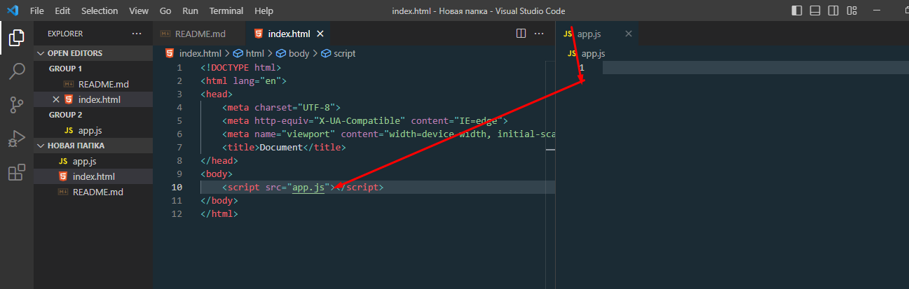

# presintation

>JavaScript дар ибтидо барои "зинда кардани саҳифаҳои веб" сохта шудааст .

> Барномаҳо дар ин забон скрипт номида мешаванд . Онҳо метавонанд дар HTML ворид карда шаванд ва ҳангоми бор кардани саҳифаи веб ба таври худкор кор кунанд.
Ин забаон барои ба харакат даровардани сайт кор мекунад.

> Сферы применения JavaScript
> Разрабатывать нативные приложения. С помощью фреймворка React Native создаются приложения для Android и iOS.
Серверные приложения. Node. ...
Десктопные приложения. ...
Программировать оборудование и бытовую технику, например, платёжные терминалы и телевизионные приставки

 Мо метавонем Html-ро бо 3 рох ба js  пайваст кунем 1.дар сахифахои алохида 2. дар даруни HTML

> JavaScript Variables and Constants.
